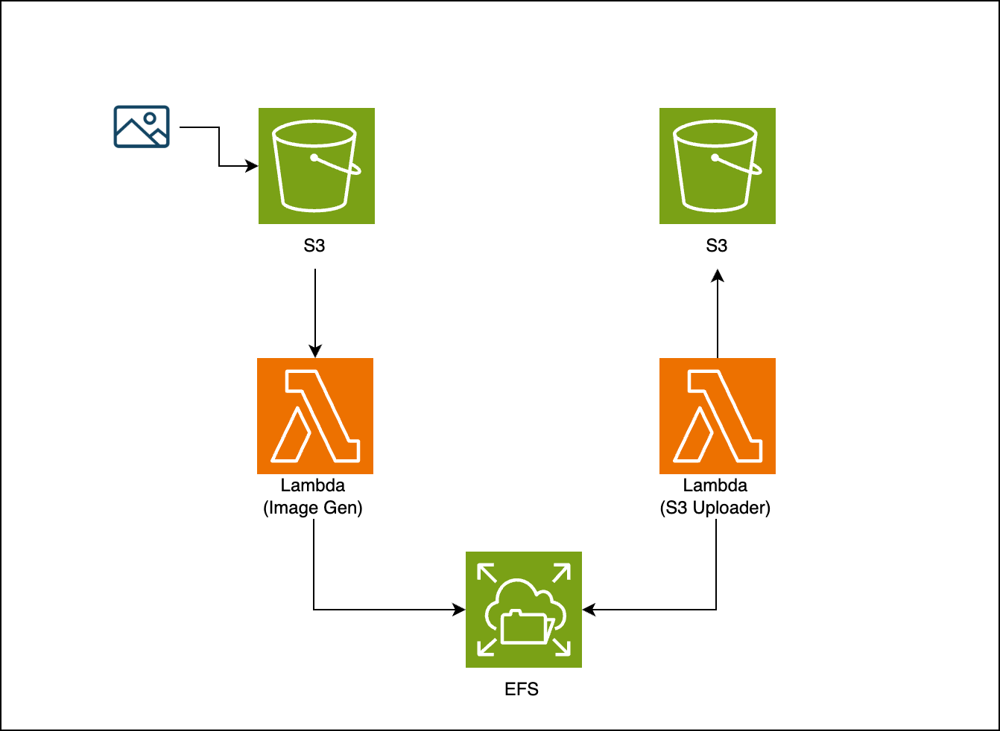

# Serverless Activity

## Overview

This activity will require you to create few serverless resources in AWS. See the diagram below.


1. S3 Bucket
2. Lambda Function
3. SQS Queue
4. EFS

## Setup

Run the command listed below to setup and deploy the resources.

```bash
# 1. Install serverless
npm i serverless -g

# 2. Install dependencies
npm i

# 3. Deploy
serverless deploy
```
